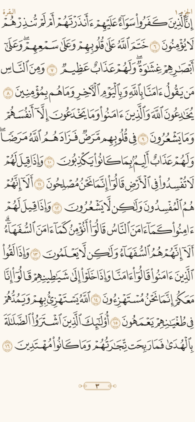
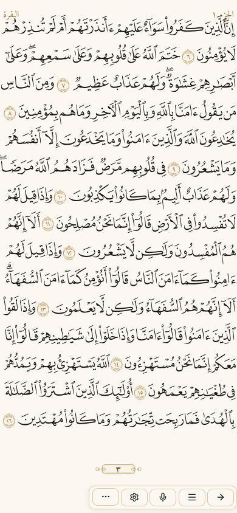
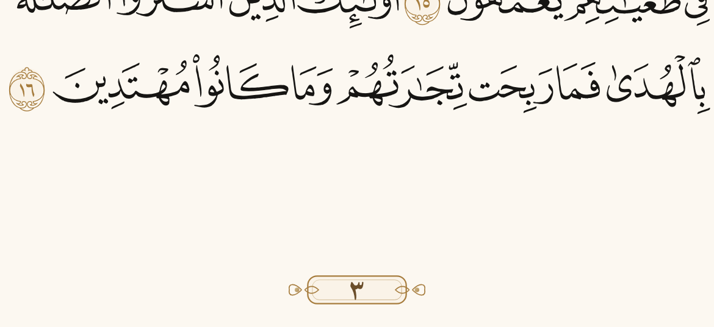
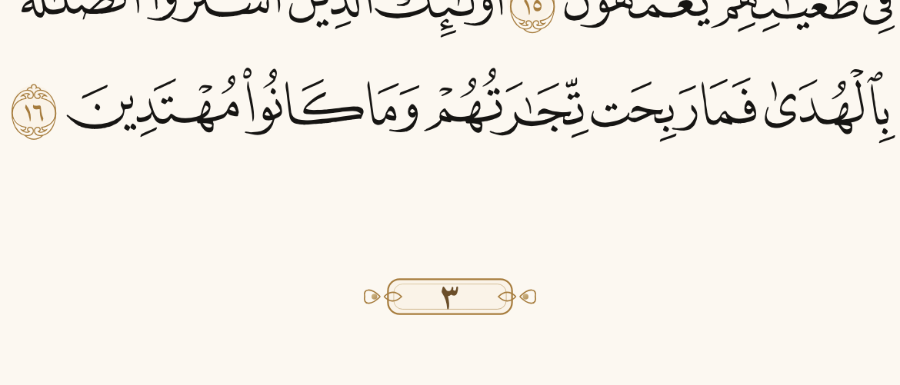

# تقرير نطاقات المصحف — `fix/mushaf-layout-bands`

> القياس على **390×844** عبر Playwright + Vite محلي. كل رقم أدناه من اللقطة/المستطيل المرسوم، لا من قراءة الكود وحدها.

## المشكلة

رفع الامتلاء أنتج تراكبين: خرطوش رقم الصفحة فوق آخر سطر، وشريط الأدوات فوق آخر سطرين/الخرطوش عند الإظهار.

## الحل

أربعة نطاقات متتالية لا تتقاطع (`layout-bands.ts` + CSS vars):

```
[safe-area-top]
headerBand → contentBand → [gap≥12] → footerBand → toolbarBand (محجوز دائماً)
[safe-area-bottom]
```

`mushaf-grid.json` يبقى مشتقًا من **contentBand** (`.mf2-lines`) فقط، مرجع ص٢٨٣.

---

## 1) ارتفاعات النطاقات المقيسة (ص٣)

| نطاق | px | ٪ من 844 |
|------|-----|----------|
| headerBand | **38.25** | 4.53٪ |
| contentBand (`.mf2-lines`) | **701.75** | 83.15٪ |
| content→footer gap (محجوز) | **12** | 1.42٪ |
| footerBand | **40** | 4.74٪ |
| toolbarBand | **52** | 6.16٪ |
| **المجموع** | **844** | 100٪ |

هندسة ص٣ (شريط مخفي):

| عنصر | top | bottom |
|------|-----|--------|
| `.mf2-lines` | 16.5 | 718.25 |
| آخر حبر سطر | 685.65 | **694.68** |
| footerBand | **752** | 792 |
| خرطوش «٣» | 757 | 787 |
| toolbar (عند الإظهار) | 798.91 | 838 |

- فاصل حبر→ذيل: **57.3px** (≥12)
- تقاطع خرطوش×حبر: **0**
- تقاطع شريط×حبر/خرطوش/إطار/شارة: **0**
- إزاحة خطوط الأساس عند إظهار الشريط: **0px**

---

## 2) الشبكة (`mushaf-grid.json` من contentBand)

مرجع ٢٨٣ — `baselinesPct` 4.0…96.0 بخطوة 6.5714، `slotHeightPct` 7.2، fill داخل contentBand ≈ **0.943**.

| صفحة | maxDevPx عن شبكة ٢٨٣ | فاصل حبر→ذيل |
|------|----------------------|---------------|
| 3 | 0.014 | 57.3px |
| 4 | 0.014 | 57.3px |
| 7 | 0.014 | 57.3px |
| 100 | 0.014 | 57.9px |
| 283 | 0.014 | 57.4px |
| 306 | 0.014 | 57.3px |
| 400 | 0.014 | 57.3px |
| 500 | 0.014 | 57.3px |
| 588 | 0.014 | 57.3px |
| 596 | 0.014 | 57.9px |
| 599 | 0.014 | 57.9px |
| 600 | 0.013 | 57.9px |
| 601 | 0.012 | 56.2px |
| 604 | 0.012 | 56.0px |

كل القيم ≤ **2px** (بوابة `test:mushaf-layout-bands`).

---

## 3) لقطات ص٣

| ملف | المعنى |
|-----|--------|
| `docs/mushaf-bands/p3-toolbar-off.png` | شريط مخفي — صفر تقاطع |
| `docs/mushaf-bands/p3-toolbar-on.png` | شريط ظاهر — صفر تقاطع + ثبات الأسس |
| `docs/mushaf-bands/p3-cartouche-before-prod-x3.png` | ×3 منطقة الخرطوش على الإنتاج قبل الدمج |
| `docs/mushaf-bands/p3-cartouche-after-x3.png` | ×3 نفس المنطقة بعد النطاقات |









---

## 4) عتبات الامتلاء (بعد contentBand)

مثبّتة في `docs/MUSHAF_SPEC.md`:

- مقياس الامتلاء = حبر داخل **contentBand** لا الشاشة الكاملة
- عتبة تشغيلية: **0.92–0.96** داخل `.mf2-lines`
- مرجع ٢٨٣: ≈ **0.943**

---

## 5) البوابات

- `pnpm run test:mushaf-layout-bands` — ok
- `pnpm run test:mushaf-toolbar-overlap` — ok
- `pnpm run test:mushaf-spec-lockdown` — ok
- `pnpm run test:mushaf-opening-frame` — ok

CFBundleVersion → **32**.
