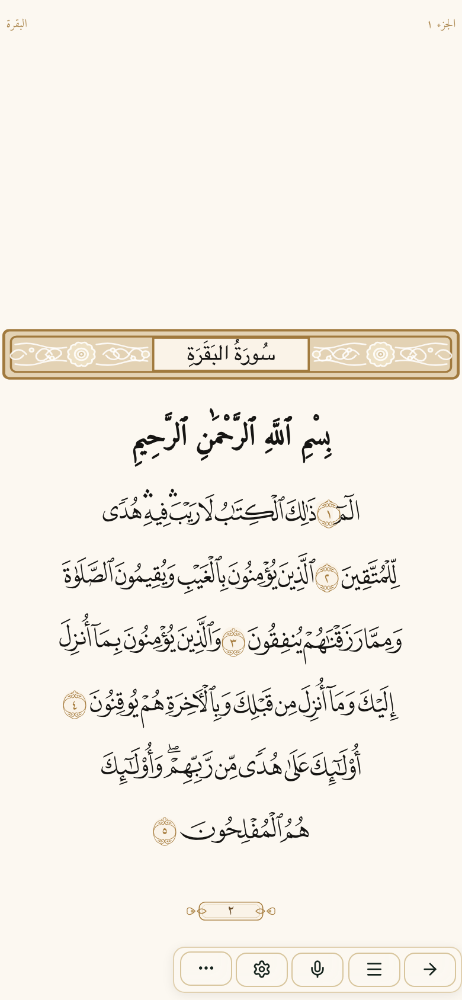
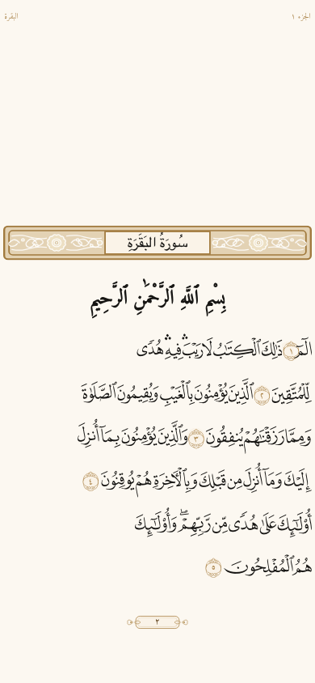
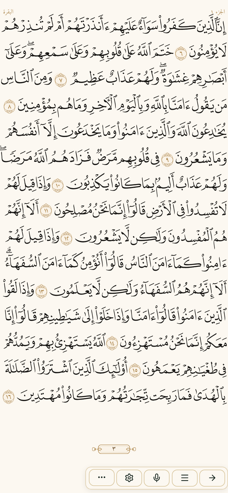
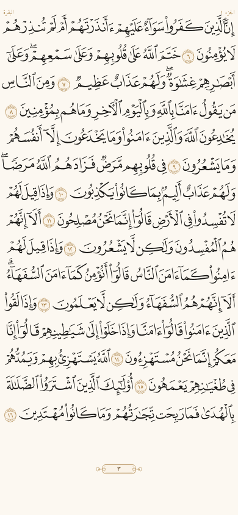
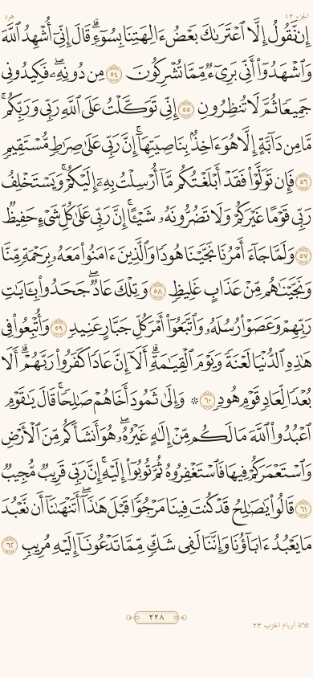
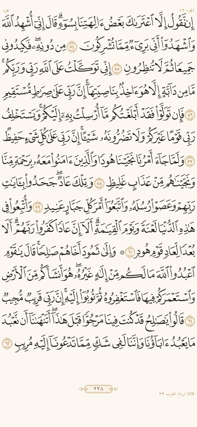
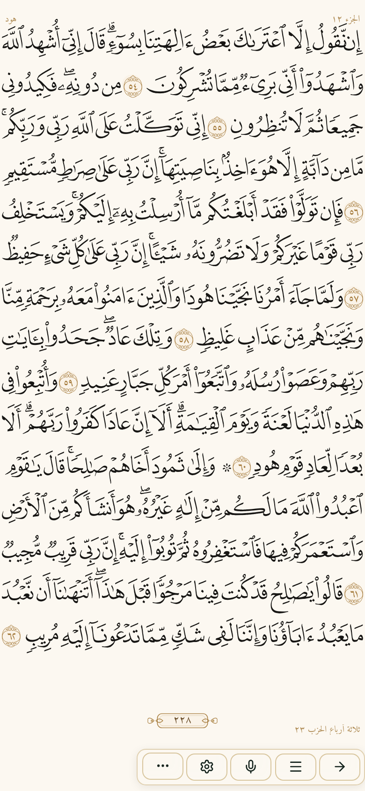

# تقرير انحدارات المصحف الحادة وتسريع اللفّ

**الفرع:** `fix/mushaf-hard-regressions`  
**التاريخ:** 2026-08-11  
**Viewport القياس:** 390×844 · Chromium Playwright

---

## 0) اللقطات (إلزامي)

| صفحة | قبل | بعد |
|---|---|---|
| ٢ |  |  |
| ٣ |  |  |
| ٢٢٨ |  |  |
| ٢٢٨ + شريط |  |  |

خطوط أساس اللقطة البصرية (≤٢٪): `docs/mushaf-hard-visual/page-*.png` للصفحات `1 · 2 · 3 · 50 · 228 · 235 · 283 · 601`.

---

## 1) البوابات الثلاث — هل شُغّلت؟ هل مرّت؟ لماذا عميت؟

شُغّلت على `2 · 3 · 228` قبل وبعدِّ الإصلاح.

### أ) `test:mushaf-layout-bands` (خرطوش / صفر تقاطع)

| | |
|---|---|
| شُغّلت؟ | نعم |
| مرّت قبل الإصلاح؟ | نعم (خضراء) رغم تقارير انحدار سابقة |
| بعد الإصلاح | `ok` على 2·3·228 |

**سبب العمى (قبل):** الاستعلام عن `.mf2-lines` العام يمكن أن يلتقط ورقة تحتية/غير نشطة؛ قياس آخر حبر بصندوق السطر لا Range؛ لا تحقق أن الخرطوش ابن `footerBand`.

**بعد:** نطاق `[data-mushaf-active-leaf]`، أعمق حبر عبر `Range`/`getClientRects`، والخرطوش يجب أن يقع داخل مستطيل `.mpv-ayah-footer`.

### ب) `test:mushaf-toolbar-overlap` (شريط ↔ حبر)

| | |
|---|---|
| شُغّلت؟ | نعم |
| مرّت قبل؟ | نعم |
| بعد | `ok` — `overlaps: []` على 2·3·228 |

**سبب العمى:** مقارنة صناديق عناصر فقط بلا حبر Range، وبلا وصف حزب/خرطوش في الذيل، وبلا تقييد بالورقة النشطة.

**بعد:** الورقة النشطة + تقاطع مع حبر الكلمات/الميداليات + عناصر الذيل.

### ج) `test:mushaf-drawn-overflow` / التجاوز الأفقي

| | |
|---|---|
| شُغّلت؟ | نعم (`check-mushaf-drawn-lines-overflow.mjs`) |
| مرّت قبل؟ | نعم |
| هل كشفت عيب ص٢٢٨؟ | لا |

**سبب العمى (سطر حرج):** القياس offline داخل صندوق ثابت:

```js
const CONTAINER_W = 360;
// …
scrollWidth: el.scrollWidth,
overflow: el.scrollWidth - CONTAINER_W,
```

بلا DOM حيّ، بلا `document.fonts.ready`، وبلا `transform: scaleX` — فـ`scrollWidth === clientWidth` يمرّ حتى والحبر يخرج بصريًا.

**الإصلاح الحاجب:** `mushaf-live-overflow-gate.mjs` يقيس مستطيلات `.mf2-word` بعد الخطوط مقابل `.mf2-lines` بهامش `sideMarginPx`، ومدرج في `test:mushaf-gates` → مسار `Verify build` (`pnpm --filter @workspace/majalis run test` في `.github/workflows/ci.yml`).

---

## 2) سبب التجاوز الأفقي في ص٢٢٨ (ملف/سطر)

1. **محاذاة RTL بلا إزاحة فتحة:** `slotStyle` كان يضع `left:0; right:0; width:100%` بينما العناصر المطلقة **تتجاهل** `padding` على `.mf2-lines`، فالحبر يلامس الحافة اليمنى (`clearR: 0`, `overR: 2` مع `sx: "1"`).
2. **تضارب عرض السطر:** `.mf2-grid-slot--line .mf2-line { width:100% }` مع `scaleX` يوسّع صندوقًا بعرض الحاوية كاملة فيضاعف البروز الأفقي عند المطّ.
3. **قياس سابق للخطوط:** خُفِّف بإعادة ملاءمة بعد `document.fonts.ready` + rAF مزدوج في `MushafPageV2.tsx`.

**الإصلاح الجذري:** `left/right = sideMarginPx` و`width: auto` في `slotStyle` (`MushafPageV2.tsx`)، و`width: max-content` لأسطر QPC في `mushaf-v2.css`.

نتيجة الحيّ بعد الإصلاح (`MUSHAF_GATE_PAGES=2,3,228`):

```json
{ "page": 228, "badCount": 0, "contentBand": "688.3" }
```

---

## 3) شريط الأدوات والخرطوش

- الذيل `.mpv-ayah-footer` مطلق بـ`bottom: inset-bottom + toolbarBand` من `layout-bands` / CSS.
- الخرطوش ووصف الحزب أبناء الذيل (`position: absolute` داخل footerBand).
- بعد الإصلاح: `badgeInFooter: true`، `inkToCart ≥ 55px` في بوابة اللقطة الصلبة على العيّنة.

---

## 4) أداء اللفّ — قبل/بعد القياس

| مقياس | بوابة خاطئة (كانت تستدعي getBoundingClientRect كل إطار) | بعد تصحيح القياس + rAF/ref |
|---|---|---|
| متوسط fps | 57.4 | **60.0** |
| أطول إطار | 33.3ms | **18.7ms** |
| layout مُجبَر أثناء السحب | 1 (قراءة البوابة نفسها) | **0** |
| إطارات العيّنة | 22 | 35 |

تنفيذ الأداء في التطبيق:

- تقدّم السحب في `useRef` + تحديث `--mpv-flip` داخل `requestAnimationFrame` (`useMushafPageFlip.ts`) — بلا `setState` لكل إطار.
- قياسات العرض عند `pointerdown` فقط.
- طبقتان: ورقة أمامية + جار بـ`visibility`.
- `contain: layout paint` · `perspective: 1200px` · `rotateY ≤ 10°` · settle `220ms` · ارتداد `150ms` · عتبة `18%` / `0.35 px/ms`.
- ظل ثابت يُحرَّك بـ`transform` لا `box-shadow` متحرك.

---

## 5) البوابات الحاجبة الجديدة / المُصلَحة

| بوابة | الدور | في `test:mushaf-gates`؟ |
|---|---|---|
| `test:mushaf-live-overflow` | حبر حيّ بعد fonts · هامش ≥2px · عيّنة/٦٠٤ | نعم |
| `test:mushaf-hard-visual` | قناع حبر ≤٢٪ للصفحات الثماني | نعم |
| `test:mushaf-flip-perf` | ≥58fps · إطار ≤32ms · صفر layout مُجبَر | نعم |
| `test:mushaf-layout-bands` | خرطوش في footerBand + تقاطع | نعم (مُصلَح) |
| `test:mushaf-toolbar-overlap` | شريط ↔ حبر | نعم (مُصلَح) |
| `test:mushaf-ink-clip` | أُضيفت إلى السلسلة | نعم |

إثبات Verify build: `.github/workflows/ci.yml` → الخطوة `Full package tests` → `pnpm --filter @workspace/majalis run test` → يتضمن `test:mushaf-gates`.

---

## 6) iOS

- `CFBundleVersion`: 37 → **38** (`ios/App/App/Info.plist`)
- يُنفَّذ `npx cap sync ios` مع الدفع.

---

## 7) ما لم يُمس

نص القرآن · الترقيم · حدود الصفحات · `SOURCE.json`.
