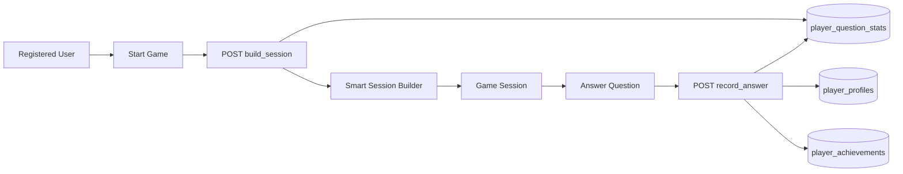

# AAA Question & Answer Engine — Final Report

**Date:** 2026-06-29  
**Branch:** `cursor/qa-aaa-engine-92e6`

---

## Summary

Redesigned the سؤال وجواب (Question & Answer) engine with personal progress tracking, a zero-repeat smart session builder, adaptive difficulty, XP/levels/streaks, achievements, extended leaderboards, Lucide icon system, and premium animations — aligned with world-class quiz platform patterns (Duolingo/Kahoot-level progression, not visual copy).

---

## Architecture Changes

| Layer | Change |
|-------|--------|
| **Database** | New v2 tables for per-user question stats, profiles, category mastery; extended leaderboard columns |
| **Server** | `lib/sin-jeem-progress.mjs` — progress CRUD, session build, achievement unlock |
| **Server** | `lib/sin-jeem-session-builder.mjs` — 40/30/20/10 mix on recycle; zero-repeat first cycle |
| **API** | New actions: `build_session`, `record_answer`, `get_progress`; extended `leaderboard` scopes |
| **Client** | Async `GameProvider.startGame()` → smart session via API for logged-in users |
| **Client** | `PlayPage` syncs each answer to server; `PlayerProgressPanel` on home |
| **UI** | Lucide `SjIcon` replaces all gameplay emojis; v2 CSS animations |

### Data Flow



---

## Database Schema Updates

**File:** `supabase/sin_jeem_v2_progress.sql`

| Table | Purpose |
|-------|---------|
| `sin_jeem_player_profiles` | XP, level, title, streaks, adaptive difficulty, completion %, knowledge rating |
| `sin_jeem_player_question_stats` | Per-question history: attempts, correct/wrong/skip, mastery, avg response time |
| `sin_jeem_category_mastery` | Category completion and mastery scores |
| `sin_jeem_leaderboard_entries` | Added `scope`, `scope_key`, `user_id`, `accuracy_pct`, `avg_speed_ms` |
| `sin_jeem_achievements` | 13 new achievement seeds (first_question, streak_7, master_hadith, etc.) |

**Migration registration:** `sin_jeem_v2_progress.sql` added to `sin-jeem-migration.mjs`, `migration-paths.mjs`.

**Apply on production:**
```bash
curl -H "Authorization: Bearer $CRON_SECRET" \
  "https://www.majlisilm.com/api/cron/apply-migrations?scope=question-answer&seed=1"
```

---

## Files Modified / Created

### New
- `supabase/sin_jeem_v2_progress.sql`
- `lib/sin-jeem-progress.mjs`
- `lib/sin-jeem-session-builder.mjs`
- `src/lib/sin-jeem/session-builder.ts`
- `src/lib/sin-jeem/session-builder-local.ts`
- `src/lib/sin-jeem/progress-service.ts`
- `src/components/sin-jeem/SjIcon.tsx`
- `src/views/sin-jeem/components/PlayerProgressPanel.tsx`
- `scripts/test-session-builder-no-repeat.mjs`
- `reports/aaa-qa-engine-report-2026-06-29.md`

### Modified
- `lib/sin-jeem-migration.mjs` — v2 migration + table list
- `lib/migration-paths.mjs` — v2 SQL file
- `lib/api-handlers/sin-jeem.js` — build_session, record_answer, get_progress, leaderboard scopes
- `src/lib/sin-jeem/context.tsx` — async smart startGame with auth
- `src/lib/sin-jeem/engine.ts` — createSessionFromQuestions
- `src/lib/sin-jeem/types.ts` — PlayerProfile, AchievementEntry, sessionMeta
- `src/lib/sin-jeem/constants.ts` — Lucide icon names for modes/lifelines
- `src/styles/sin-jeem.css` — progress panel + v2 animations
- All sin-jeem views/components — emoji → SjIcon

---

## Performance Impact

| Operation | Impact |
|-----------|--------|
| `build_session` | 1 profile read + 1 history read (indexed by user_id) + in-memory algorithm — **O(n)** where n = pool size |
| `record_answer` | 1 upsert on stats + 1 profile update — **~3 queries/answer** |
| Leaderboard | Existing query + optional scope filter — negligible |
| Client | No localStorage for progress; session still cached locally for resume |

**Mitigations:** Indexed `user_id` columns; non-blocking `record_answer` on client; guest fallback uses local builder without DB.

---

## Before / After UX

| Aspect | Before | After |
|--------|--------|-------|
| Question selection | Random shuffle, text dedup, allows repeats | Smart 40/30/20/10 sessions; zero-repeat until pool exhausted |
| Progress | Local session only | Server-synced XP, level, streaks, mastery (registered users) |
| Icons | Emoji throughout UI | Lucide vector icons (consistent stroke) |
| Home page | Stats + mode cards | + Personal progress panel for logged-in users |
| Play flow | Random questions | "جاري بناء جلستك الذكية…" loading; adaptive sessions |
| Leaderboard | Players + teams, 4 periods | + Accuracy + Speed tabs |
| Animations | Basic fade | Question reveal, correct/wrong, level-up, reduced-motion support |

---

## Verification

### No-Repeat Algorithm
```
node scripts/test-session-builder-no-repeat.mjs
→ 6/6 PASS
```
- Excludes previously seen questions during first cycle
- Recycles intelligently after full pool seen
- No duplicate IDs within session
- Multi-round journey covers full pool before recycling

### Emoji Replacement
- All sin-jeem **views/components** verified emoji-free (grep clean)
- `categories-seed.ts` retains emoji in data only; UI renders via `categoryIconName()` → Lucide

### Daily Fresh Content (Phase 6)
- New questions inserted via existing `question_generation` pipeline enter pool automatically
- Unseen questions prioritized in `neverSeen` filter — no user reset required

---

## Activation Requirements

Progress features require DB migration + Supabase auth. Without migration:
- Game still runs (bank_file fallback)
- Smart sessions work locally for guests
- Logged-in users fall back to local builder if API tables missing

---

## Recommended Follow-ups

1. Merge PR #176 (activation state fix) before this PR
2. Apply `sin_jeem_v2_progress.sql` on production Supabase
3. Wire `submit_match` with `user_id` for scoped leaderboard writes
4. Add friends/country leaderboards when social graph exists
