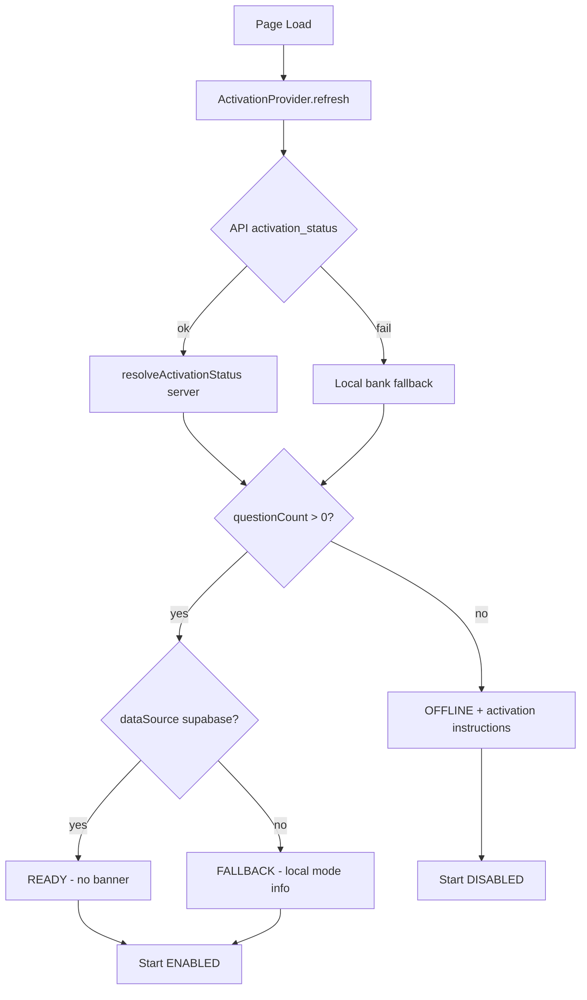

# Q&A Activation State Fix Report

**Date:** 2026-06-29  
**Branch:** `cursor/qa-activation-state-fix-92e6`

## Root Cause

The home page used **two independent data paths** that could disagree:

1. `probeQuestionAnswerDb()` — returned `dbAvailable: false` when Supabase tables were missing
2. `fetchGameStats()` — always returned **527 questions** from the local JSON bank fallback

The `DbActivationBanner` showed when `dbAvailable === false`, displaying **"اللعبة جاهزة… تحتاج تفعيل قاعدة البيانات"** while stats showed hundreds of questions and the Start button stayed enabled.

Admin controls (Retry, Open Admin, Activation Status) were visible to **all users**.

## Solution

Single activation state provider with unified health model:

```
fetch /api/question-answer?action=activation_status
        ↓
resolveActivationStatus() [server]
        ↓
ActivationProvider [client]
        ↓
SinJeemHomePage + ActivationStatusBanner
```

## Activation Logic

| Condition | Health | Banner | Start Button |
|-----------|--------|--------|--------------|
| questions > 0, categories > 0, source = supabase | **READY** | None | Enabled |
| questions > 0, categories > 0, source = bank_file | **FALLBACK** | "وضع المحتوى المحلي" | Enabled |
| questions > 0, API unreachable | **DEGRADED** | "اتصال محدود" | Enabled |
| questionCount === 0 | **OFFLINE** | Activation instructions | Disabled |

**Rule:** Activation instructions only when `questionCount === 0`.  
**Rule:** Never show "database activation required" when the game is playable.

## Files Modified

| File | Change |
|------|--------|
| `lib/sin-jeem-activation.mjs` | New server resolver |
| `lib/api-handlers/sin-jeem.js` | `activation_status` action |
| `src/lib/sin-jeem/activation-state.ts` | Types + client fetch + derive logic |
| `src/lib/sin-jeem/activation-provider.tsx` | React context provider |
| `src/views/sin-jeem/components/ActivationStatusBanner.tsx` | Replaces DbActivationBanner |
| `src/views/sin-jeem/SinJeemHomePage.tsx` | Uses provider; gates Start button |
| `src/views/sin-jeem/SinJeemApp.tsx` | Wraps ActivationProvider |
| `src/styles/sin-jeem.css` | Disabled button styles |
| `scripts/test-question-answer-activation.mjs` | Verification (14/14) |

**Deleted:** `DbActivationBanner.tsx`

## Activation Logic Diagram



## Before / After

| UI Element | Before | After |
|------------|--------|-------|
| Banner when 527 questions + no DB | "تحتاج تفعيل قاعدة البيانات" | "وضع المحتوى المحلي" (or hidden if READY) |
| Stats source | Mixed DB probe + bank counts | Same source from activation_status |
| Start button | Always enabled | Enabled only when gameReady |
| Admin buttons | All users | Admins only (when activation needed) |
| Health display | boolean dbAvailable | READY / FALLBACK / DEGRADED / OFFLINE |

## Verification

- `test-question-answer-activation.mjs` — **14/14 pass**
- `smoke-question-answer-routes.mjs` — **30/30 pass**
- `pnpm run typecheck` — pass
- `pnpm run build` — pass

## Remaining

Live deploy required to verify `/api/question-answer?action=activation_status` on production.
