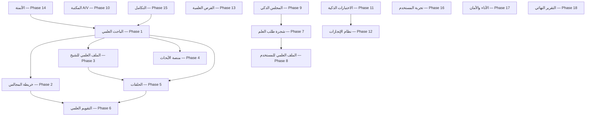

# Majlis Ilm Vision 2.0 — خارطة الطريق

> **مبدأ التنفيذ:** كل مرحلة = فرع + PR مستقل + اختبارات + تقرير. لا نشر بيانات Placeholder في الواجهة العامة.

## مخطط الربط بين الأقسام

## المراحل

| # | المرحلة | الفرع المقترح | الحالة | يعتمد على |
|---|---------|---------------|--------|-----------|
| 1 | الباحث العلمي الإسلامي | `cursor/vision-2-phase1-scholar-search-92e6` | **جاري** | scholarly-intelligence |
| 2 | خريطة المجالس العلمية | `cursor/vision-2-phase2-mosque-map-92e6` | مخطط | mosques, circles, lessons |
| 3 | الملف العلمي للشيخ | `cursor/vision-2-phase3-sheikh-profile-92e6` | مخطط | sheikhs, lessons |
| 4 | منصة الأبحاث العلمية | `cursor/vision-2-phase4-research-92e6` | مخطط | fiqh_council, PDF |
| 5 | الحلقات القرآنية والعلمية | `cursor/quran-scientific-circles-92e6` | **PR #179** | quran_scientific_circles |
| 6 | التقويم العلمي الموحد | `cursor/vision-2-phase6-calendar-92e6` | مخطط | lessons, circles, learning |
| 7 | شجرة طلب العلم | `cursor/vision-2-phase7-ilm-tree-92e6` | مخطط | learning_paths |
| 8 | الملف العلمي للمستخدم | `cursor/vision-2-phase8-user-profile-92e6` | مخطط | digital_learning |
| 9 | المجلس الذكي | `cursor/vision-2-phase9-smart-majlis-92e6` | مخطط | assistant, paths |
| 10 | المكتبة الصوتية/المرئية | `cursor/vision-2-phase10-av-library-92e6` | مخطط | library, transcribe |
| 11 | الاختبارات الذكية | `cursor/vision-2-phase11-smart-quiz-92e6` | مخطط | quiz, sin-jeem |
| 12 | نظام الإنجازات | `cursor/vision-2-phase12-achievements-92e6` | مخطط | sin-jeem XP |
| 13 | الفرص العلمية | `cursor/vision-2-phase13-opportunities-92e6` | مخطط | circles, jobs |
| 14 | الأتمتة الكاملة | `cursor/vision-2-phase14-automation-92e6` | مخطط | AKE, MKE |
| 15 | التكامل | `cursor/vision-2-phase15-integration-92e6` | مخطط | knowledge graph |
| 16 | تجربة المستخدم | `cursor/vision-2-phase16-ux-92e6` | مخطط | design-system |
| 17 | الأداء والأمان | `cursor/vision-2-phase17-perf-security-92e6` | مخطط | Lighthouse, RLS |
| 18 | التقرير النهائي | — | بعد 1–17 | — |

## قواعد البيانات

- **لا Placeholder في الواجهة العامة**
- حالة `review` للبيانات غير المؤكدة
- كل كيان جديد يرتبط بـ: sheikh_id, mosque_id, topic_slugs, calendar_event (Phase 15)

## ما موجود مسبقاً (~40% من Vision 2.0)

| مكون | نسبة الجاهزية |
|------|---------------|
| scholarly-intelligence search | 65% |
| Quran Scientific Circles | 80% |
| Digital Learning / My Learning | 65% |
| SinJeem / Quiz | 75% |
| Fiqh Council / Research | 55% |
| Automation backends | 85% admin |
| Maps | 25% |
| Sheikh SPA profiles | 40% |
| AV Library | 30% |
| Platform-wide XP | 25% |

## Phase 1 — نطاق هذا PR

- توسيع `unifiedSearch` ليشمل: قرآن، تفسير، حديث، متون، حلقات، أبحاث، علماء، مساجد
- API autocomplete: `/api/search-autocomplete`
- إصلاح دمج نتائج SearchPage (لا short-circuit)
- واجهة «الباحث العلمي الإسلامي» على `/search` و `/scholar-search`
- فلاتر حسب نوع المحتوى + اقتراحات + fuzzy
