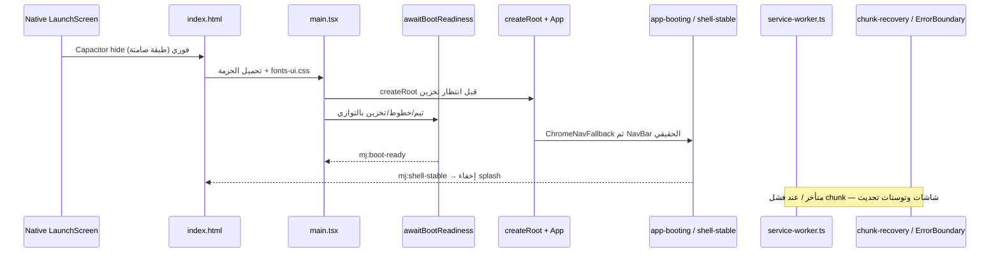

# Startup Root Cause Report — PR-0 (Timeline + Baseline)

**Program:** Sunnah Startup Pipeline Rebuild  
**Stage:** PR-0 — Measure + inventory only (لا إصلاح منتج هنا)  
**Base commit:** `c7816065a5537ee13651db30b93cc5395b2d13e4` (`origin/main` at branch cut)  
**Measured at:** `2026-09-23T19:05:08Z`  
**Environment:** local agent · code-path inventory + DEV marks wiring  
**Metrics JSON:** `docs/performance/startup-pr0-baseline-metrics.json`  
**Product:** `artifacts/majalis`

لا أرقام مخترعة. ما لم يُقَس على جهاز/TestFlight في هذه الجلسة = **NOT MEASURED**.  
لا إعلان `SUNNAH_STARTUP_STABLE_AND_RELEASE_READY` في PR-0.

---

## 1) Startup graph (الوضع الحالي)



### مسار الإقلاع المقصود لاحقًا (عقد البرنامج)

`Native Launch → Stable App Shell → Home Content` فقط.

### مسار الإقلاع الحالي (مثبت بالكود)

1. **Native LaunchScreen** (لون/قصة لوحة)  
2. **Capacitor SplashScreen** يُخفى فور `armNativeSplashController`  
3. **`#mj-launch-splash`** (هوية + عبارة + progress) حتى `mj:shell-stable` أو سقف **1400ms**  
4. **`createRoot` فوري** → Home/Chrome قد تُرسم تحت splash أو بعد `clearBooting`  
5. **`awaitBootReadiness`** (خطوط ≤280ms · تخزين ≤450ms) → `mj:boot-ready`  
6. **`whenAppShellStable` + grace 600ms** → `mj:shell-stable`  
7. طبقات لاحقة: OfflineBanner · UpdateAvailableBanner · ChunkRecoveryToast · SW بعد 5s

---

## 2) Timeline مطلوب التسجيل (Cold Start)

| مرحلة | مصدر الحقيقة الحالي | علامة DEV | حالة القياس |
|---|---|---|---|
| Native launch start | iOS LaunchScreen / Capacitor | — | NOT MEASURED (جهاز) |
| WebView / process start | نظام | — | NOT MEASURED |
| JavaScript start | `main.tsx` `mount()` | `startup:js-start` | موصول |
| Root mount | بعد `createRoot().render` | `startup:root-mounted` | موصول |
| Theme hydration | `dataset.theme` قبل/مع boot | `startup:theme-ready` | موصول (مجمّع مع boot) |
| Font initialization | `document.fonts` في `boot-readiness` | `startup:fonts-ready` | موصول (مجمّع) |
| Session restoration | AuthProvider لاحقًا؛ التخزين عبر hydrate | `startup:session-ready` | موصول تقريبي (تخزين boot لا session كامل) |
| Local storage restoration | `hydrateNativeStorage` + gate | (ضمن session-ready) | جزئي |
| Service Worker registration | بعد load + **5s** | `startup:cache-ready` | **غير موصول بعد** (محجوز PR-6) |
| Cache check | `/version.json` · SW update | — | NOT MEASURED |
| Content bootstrap | `mj:app-painted` / Home | `startup:content-ready` | موصول |
| Header mount | Suspense → ChromeNavFallback → NavBar | — | NOT MEASURED (عدادات PR-8) |
| Home mount | HomeView / HomeHeroLcp | — | NOT MEASURED |
| Bottom Navigation mount | ChromeBottomFallback → BottomNavBar | — | NOT MEASURED |
| First interactive frame | بعد زوال splash + shell | — | NOT MEASURED |
| First stable frame | `markAppShellStable` | `startup:shell-ready` + `startup:stable` | موصول (متزامنان اليوم) |
| Native splash end | بعد hide Capacitor | `startup:native-end` | موصول |

ملف العلامات: `artifacts/majalis/src/lib/startup-performance-marks.ts` — **DEV فقط** (`import.meta.env.DEV` أو `__SUNNAH_STARTUP_MARKS__`).

---

## 3) جرد مصادر الجاهزية / الشاشات / الإشعارات

### 3.1 مصادر حالة متعددة (قبل توحيد AppStartupController)

| مصدر | ملف | يغيّر UI؟ |
|---|---|---|
| `html.app-booting` / `dataset.appBooting` | `index.html` + critical CSS | نعم — يقفل هندسة chrome |
| `mj:boot-ready` + `BootFlags` | `boot-readiness.ts` | غير مباشر |
| `mj:shell-stable` / `dataset.shellStable` | `app-shell-stability.ts` | يخفي splash |
| `SPLASH_*` + session key | `majlis-splash.ts` / `splash-screen.ts` | دخولية HTML |
| Chunk recovery in-flight | `chunk-recovery.ts` | Toast + صفحة «تحديث العرض» |
| Version update | `useVersionCheck` + `UpdateAvailableBanner` | بنر تحديث |
| Offline / outbox pending | `OfflineBanner.tsx` | شريط أعلى |
| Auth session | `AuthProvider` | أزرار حساب في الهيدر |
| Theme class | ثيم مبكر في HTML + تفضيل لاحق | وميض محتمل إن تأخّر |
| Fonts `dataset.mjFonts` | بعد `awaitBootReadiness` | FOUT إن تجاوز السقف |

**لا يوجد `AppStartupController` بعد في PR-0.** حالات البرنامج (NATIVE_LAUNCH…FATAL_ERROR) هدف **PR-1** — نُفِّذ في `artifacts/majalis/src/lib/app-startup-controller.ts` بعد دمج هذا التقرير.

### 3.2 ترتيب Providers / Mount (مختصر)

```
main: ChunkRecoveryToast + ErrorBoundary + QueryClientProvider + App
App: … Language / AuthProvider / Router shell …
```

- `createRoot` **مرة واحدة** في `mount()` — جيد.  
- لا يُثبَت بعدد mount counters بعد (PR-8).  
- `ChromeNavFallback` / `ChromeBottomFallback` يملآن Suspense — هندسة غير مطابقة للهيدر الكامل → قفزات أزرار.

### 3.3 شاشات / طبقات دخولية (جرد)

| سطح | دور | يبقى بعد PR-0؟ |
|---|---|---|
| iOS LaunchScreen | أصلي | نعم (يُصقل PR-3) |
| Capacitor SplashScreen | يُخفى فورًا | يُراجع PR-3 |
| `#mj-launch-splash` | دخولية هوية | يُعاد عقدها PR-3/7 |
| `native-load-error.html` | فشل تحميل | يُبقى كـ FATAL |
| ErrorBoundary «تحديث العرض» | استعادة chunk | يُزال كصفحة كاملة PR-7/8 |
| ChunkRecoveryToast | إشعار تحديث | يُدمج في Toast Manager PR-7 |
| UpdateAvailableBanner | تحديث نسخة | خلفية + مرة واحدة PR-6/7 |
| OfflineBanner pending | «محفوظ محليًا — تتم مزامنة N» | لا للمستخدم العام كـ DEBUG (PR-2/7) |

---

## 4) عمليات متوازية vs متسلسلة بلا ضرورة

| مسار | سلوك | ملاحظة |
|---|---|---|
| CSS حرج متزامن في `main.tsx` | تسلسلي ثقيل قبل mount | ينافس FCP |
| `createRoot` ثم hydrate تخزين | متوازٍ (صحيح) | كان await قبل mount → شاشة بيضاء |
| خطوط + تخزين في boot | متوازٍ بسقف | جيد جزئيًا |
| SW register بعد 5s | متأخر عمدًا | يقلل تنافس LCP؛ `cache-ready` متأخر |
| `SHELL_STABLE_GRACE_MS = 600` | تأخير بعد زوال booting | يؤخر `shell-stable` / إخفاء splash |
| `clearBooting` سقف 1400ms في index | أمان | قد يكشف Home قبل fonts إن سُبقت |
| Dark CSS ديناميكي إن dark | متوازٍ | جيد |

---

## 5) أسباب إعادة Render / Layout Shift (من الكود + الأعراض)

1. **Suspense chrome:** Fallback ناقص الأيقونات → NavBar كامل يحلّ مكانه.  
2. **Auth hydration:** مساحة الحساب تتبدل guest↔user إن لم يثبَّت placeholder بنفس المقاس.  
3. **خطوط Amiri:** إن تجاوزت `BOOT_FONT_TIMEOUT_MS` يظهر نص بمقاييس fallback ثم يقفز.  
4. **Hero:** بيانات الورد/التقدم تصل بعد أول إطار (`HomeHeroLcp`).  
5. **BottomNav:** active من المسار بعد hydrate الراوتر يُصحَّح متأخرًا إن وُجدت حالة افتراضية.  
6. **إزالة `app-booting`:** تغيّر قيود min-height/overflow دفعة واحدة.  
7. **OfflineBanner / Update / Chunk toast:** تضيف شريطًا فوق المحتوى → إزاحة رأسية.

---

## 6) السبب الجذري لكل عرض مؤكد (الصور)

| # | العرض | السبب الجذري (كود) | PR لاحق |
|---|---|---|---|
| 1 | الرئيسية قبل اكتمال الجاهزية | `createRoot` قبل MINIMUM_READY موحّد؛ `clearBooting`/`shell-stable` مصادر متعددة | PR-1/4 |
| 2 | فراغ أبيض علوي قبل Header | فترة بدون chrome أو Fallback بلا ارتفاع مكتمل / safe-area | PR-4 |
| 3 | عناصر رأس ناقصة/شفافة | `ChromeNavFallback` مبسّط + lazy NavBar | PR-4 |
| 4 | أحجام أزرار الحساب/بحث/ليلي/قائمة تختلف | Fallback ≠ الهيكل النهائي + Auth متأخر | PR-4 |
| 5 | شريط «…محليًا…مزامنة N عنصرًا» | `OfflineBanner` نص pending للمستخدم العام؛ قرب Status Bar | PR-2/7/13 |
| 6 | آية اليوم خلف/مقصوصة تحت Header | محتوى يُرسم قبل ثبات `--app-top-chrome-h` / overlap | PR-4/5 |
| 7 | Hero يتحرك بعد الخطوط | عرض قبل `fonts-ready` أو بعد swap خط | PR-2/5 |
| 8 | مربعات/طبقات مؤقتة في Hero | placeholders غير مطابقة أو طبقات CSS مؤجّلة | PR-5 |
| 9 | BottomNav متأخرة / active يتغير | `ChromeBottomFallback` ثم hydrate مسار | PR-4/12 |
| 10–12 | «تحديث العرض» + Toast طويل/مكرر | `ErrorBoundary` recovering UI + `ChunkRecoveryToast` + `tryRecoverFromStaleChunk` → reload | PR-7/6 |
| 13 | SW/Cache يرتبطان بإعادة عرض | `safeLocationReload` من chunk-recovery؛ رسائل SW | PR-6/9 |
| 14 | قفزة خط عربي | Amiri اختياري/متأخر؛ أوزان إضافية لاحقًا | PR-2 |
| 15 | حالات تقنية للمستخدم | OfflineBanner pending · chunk toast · update full-page | PR-7/13 |

> ملاحظة نصّية: العرض «خطوط محليًا» في التقارير البصرية يطابق مصدر `OfflineBanner`: **«محفوظ محليًا — تتم مزامنة {n} عنصرًا»** (قراءة بصرية قريبة من Status Bar).

---

## 7) Service Worker / Cache (حالة PR-0)

- تسجيل مؤجّل `SW_REGISTER_DELAY_MS = 5000`.  
- `controllerchange` → **لا reload تلقائي بعد الجلسة** (بنر هادئ) — تحسّن جزئي موجود.  
- استعادة chunk ما زالت تستدعي `safeLocationReload({ force: true })` بعد 80ms مع Toast.  
- `skipWaiting` موجود في SW (بوابات نصية) — يُراجع ذرّية الكاش في PR-6.

---

## 8) Baseline أداء (هذه الجلسة)

| مقياس | قيمة |
|---|---|
| Bundle entry/CSS budgets | راجع `SUNNAH_WORLD_CLASS_BASELINE` / بوابات الميزانية — **لا رفع** |
| Cold start → shell (جهاز) | NOT MEASURED |
| CLS ميداني Cold Start | NOT MEASURED |
| Root/Header/Home mount counts | NOT MEASURED (عدادات DEV في PR-8) |
| لقطات شاشة جهاز/TestFlight | NOT CAPTURED THIS RUN |

**لقطات إطار منطقية (جرد بدون ملفات صورة هذه الجلسة):**

1. Native solid color  
2. `#mj-launch-splash` هوية  
3. `app-booting` + chrome fallback  
4. Home تحت splash أو بعد الكشف المبكر  
5. OfflineBanner / Chunk toast فوق المحتوى  
6. «تحديث العرض» full-page عند stale chunk  

إعادة الالتقاط: جهاز + Slow Motion في PR-10 / تحقق TestFlight.

---

## 9) خطة PRs (لا تُنفَّذ في PR-0)

| PR | هدف |
|---|---|
| **0** | هذا التقرير + علامات DEV + بوابة + baseline JSON |
| **1** | `AppStartupController` state machine — `src/lib/app-startup-controller.ts` |
| **2** | خطوط Amiri مسبقة + إخفاء مزامنة OfflineBanner عن المستخدم (`DEBUG_ONLY`) |
| 2 | خطوط + إخفاء sync عن المستخدم |
| 3 | Native launch + دخولية واحدة |
| 4 | App Shell + Header + BottomNav ثابتان |
| 5 | Hero hydration مستقر |
| 6 | SW + كاش ذري |
| 7 | Toast Manager + حذف شاشة التحديث |
| 8 | منع remount + تنظيف Providers |
| 9 | Offline / recovery |
| 10 | مصفوفة أجهزة + أداء + visual |
| 11 | حذف legacy + تحقق نهائي |

كل PR من أحدث `origin/main` بعد دمج السابق.

---

## 10) قبول PR-0 فقط

- [x] تقرير سبب جذري  
- [x] علامات `startup:*` DEV موصولة للنقاط الأساسية  
- [x] جرد مصادر الحالة والشاشات  
- [x] metrics JSON بلا أرقام مخترعة  
- [x] بوابة نصية `test:startup-pr0`  
- [ ] قياس جهاز/TestFlight → مؤجّل PR-10  
- [ ] `SUNNAH_STARTUP_STABLE_AND_RELEASE_READY` → **ممنوع** حتى PR-11 + جهاز
