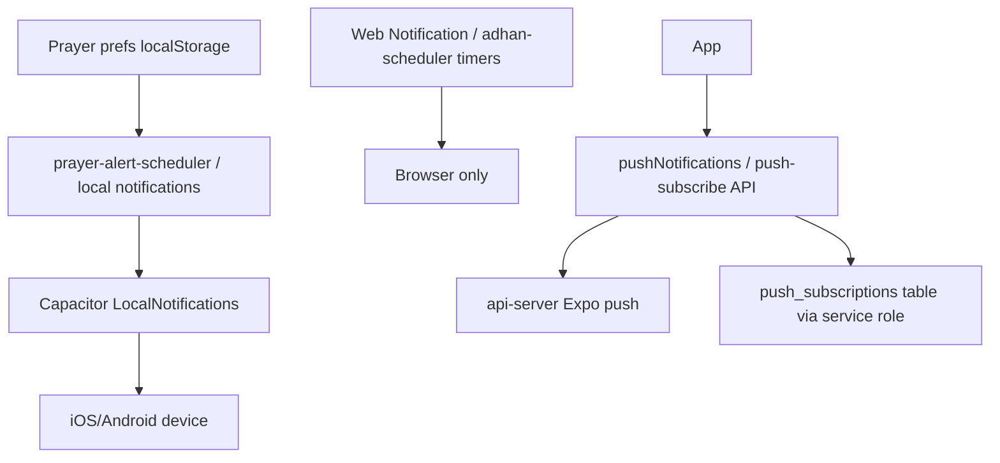
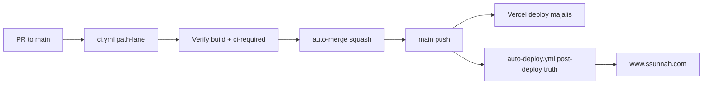
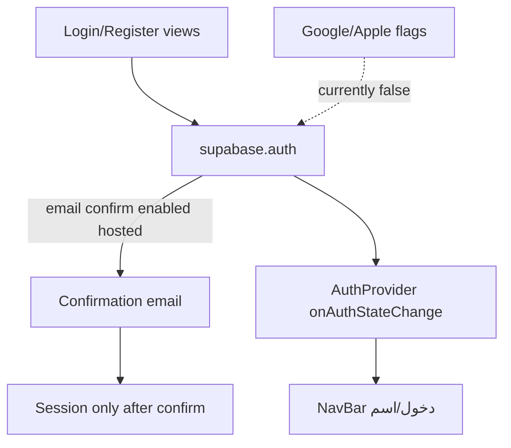
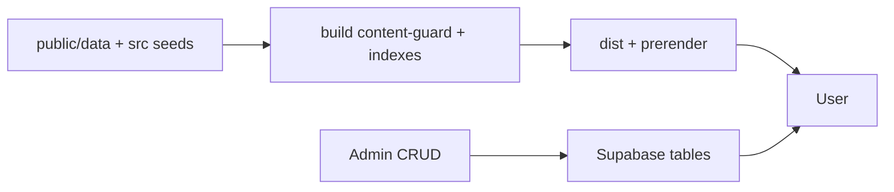

# 02 — المعمارية

**Commit:** `975505911116f6190e2d09fc97ced3dbbb02e37d`

## Web

- Entry: `artifacts/majalis/src/main.tsx` يستورد CSS حرج ثم يركّب التطبيق.
- Shell: `App.tsx` — مسار `/` عبر `HomeLazyRoute`؛ باقي المسارات lazy `AppRoutes`.
- Router: **wouter** (ليس React Router). Confirmed: deps + `App.tsx`/`AppRoutes.tsx`.
- Styling: Tailwind v4 عبر `@tailwindcss/vite` + ملفات `src/styles/**` و`app/styles/**`.
- Data: `@supabase/supabase-js` من المتصفح؛ React Query موجود في الكتالوج للاستخدام حيث وُظف.
- SEO: `generate:seo` + `prerender.mjs` + `post-build-seo.mjs` داخل سلسلة `build`.

## Mobile (Capacitor)

- Config: `artifacts/majalis/capacitor.config.ts` (`appId`, `webDir=dist`, server `https://www.ssunnah.com`).
- Sync: build ويب ثم `cap sync` (لا تعتمد على public ملتزم في git).
- Plugins: Local Notifications, Push Notifications, App, Haptics, Preferences (من `package.json`).
- iOS/Android مشاريع تحت `artifacts/majalis/ios`, `android`.
- Fastlane جذر/`artifacts` حسب workflows `ios-testflight-deploy.yml`.

## Backend / API

- لا خادم تطبيق كامل منفصل للمنطق الأساسي.
- Vercel serverless تحت `artifacts/majalis` لـ`/api/*` (مساعد، جاهزية، اشتراك push، …) — تفاصيل الملفات تحت `lib/api-handlers` ونظائرها.
- `artifacts/api-server`: Express + `expo-server-sdk` لتسجيل/إرسال Expo push؛ تخزين tokens في ملف JSON محلي للخادم (ليس جدول Supabase). Confirmed: استكشاف api-server.

## Supabase

- Auth + Postgres + (اختياري) Realtime حسب الجداول.
- العميل: `src/lib/supabase.ts` → bootstrap/env.
- Schema: ملفات SQL متداخلة في `supabase/` و`artifacts/majalis/supabase/` و`.migration-backup/`.
- تطبيق المستضاف: يدوي / workflows بموافقة — **حالة المستضاف Unverifiable من git**.

## Notifications

## Audio

- أذان: كتالوجات `adhan-*` + ملفات `public/sounds/adhan` / iOS CAF.
- تلاوة: مصادر خارجية (everyayah/mp3quran) موثّقة في CREDITS مع قيود ترخيص.
- مشغلات في ميزات القرآن/المصحف (HLS.js موجود كاعتماد).

## Deployment

**CONFLICT:** جذر `DEPLOYMENT.md` يصف فرع `production` يدويًا — يتعارض مع `vercel.json` و`auto-deploy.yml`. انظر ملف CI.

## Authentication

## Data flow (محتوى)

## State / Cache / Routing

- حالة محلية: React state/context + localStorage مفاتيح `majalis-*`.
- Offline جزئي: Dexie مذكور كاعتماد؛ مصحف/بيانات عامة كملفات ثابتة.
- Caching: Service Worker / `sw-version.js` مربوط بـ`SW_BUILD_ID` عند البناء.
- Routing: wouter Switch؛ immersive chrome للمصحف يخفي أشرطة عامة (`isImmersiveChromePath`).

## Feature boundaries

- صفحات مجال: `src/pages/{quran,worship,fiqh,hadith,lessons,library,account,scholars,assistant,tazkiya}/`.
- صفحات مسطّحة كثيرة: `src/views/*.tsx`.
- مصحف: `features/mushaf-reader`, `features/mushaf-madinah`.
- لا تعدّل `mushafi` كمنتج متجر 1.0.0.
