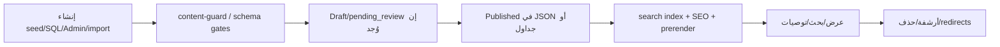

# 08 — نظام المحتوى

**Commit:** `975505911116f6190e2d09fc97ced3dbbb02e37d` · لا تصحيح محتوى في هذه المهمة.

## دورة المحتوى

## مصادر

| نوع | أمثلة مسارات |
|---|---|
| ثابت JSON | `artifacts/majalis/public/data/**` (hadith-verified, knowledge, quran, quran-v2, …) |
| Seeds TS | `src/lib/*-seed.ts`, `verified-hadith-fill-*.ts`, `updates-seed.ts` |
| Supabase | دروس، فوائد، ملفات، … عبر `supabase.ts` helpers |
| مولَّد عند البناء | search index, seo routes html, content-counts, rulings encyclopedia scripts |
| استيراد | scripts `import-content`, Instagram/Kuwait pipelines (admin) |

## حالات النشر

- حقول `pending_review` / draft في موسوعات الأحكام (تقارير inventory).
- حوكمة: لا نشر شرعي بلا مصدر — قواعد Cursor content-governance + بوابات.
- تصنيف Verified / Needs verification / Unsupported مستخدم في تقارير الجودة (مثل CONTENT_GAPS).

## Validation

- `test:content-guard` داخل `build`.
- بوابات: ayah, hadith, dupes, links, quality, lang، و`content-quality-r7-gate`.
- `check:editorial`, `check:sources-and-licenses`, `check:copy-quality`.

## بحث وتوصيات

- فهرس مولَّد عند البناء؛ صفحة `/search`.
- RelatedRail مع منع slug خام (r7).
- لا قرارات فقهية في نتائج بعد إزالة المنتج (بوابات).

## SEO

- `generate:seo`, prerender, sitemap، meta consistency gates.
- منع فهرسة admin ومسارات مجلس حساسة.

## نتائج مسح (مثبتة في المستودع/تقارير — بلا إصلاح هنا)

| ظاهرة | حالة |
|---|---|
| Placeholder / lorem | تُمنع ببوابات؛ أي ظهور جديد = فشل بوابة |
| نصوص مقطوعة salutation | عُولجت في r7 للملفات المذكورة في البوابة |
| قرارات فقهية / مجمع | منتج محذوف؛ بقايا redirect/SEO؛ جداول SQL قد تبقى |
| أسماء مشروع قديمة | بوابات تبحث عن بقايا؛ افحص عند التغيير |
| Internal IDs | تطبيع آيات + «درس بلا عنوان» |
| Demo | يجب ألا يدخل production (بوابات) |
| كتب بلا مصدر URL | LICENSE_RISKS / gaps — Needs verification |

ملف فجوات حديث: `artifacts/majalis/docs/CONTENT_GAPS_REPORT.md`.
